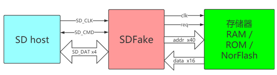
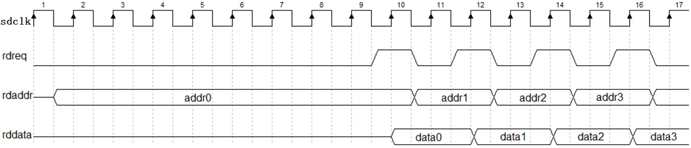
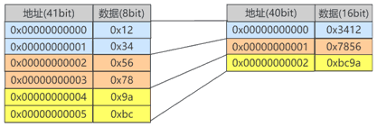
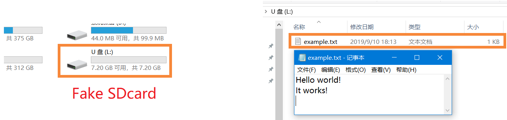
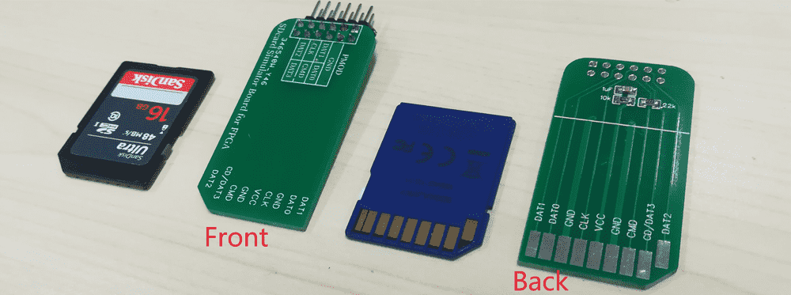
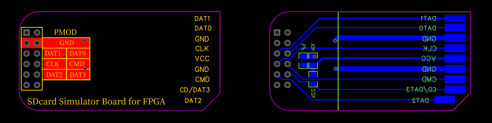
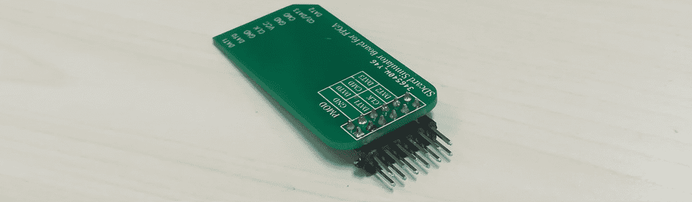
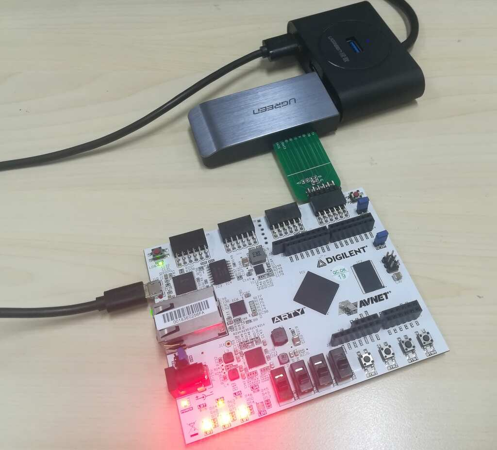
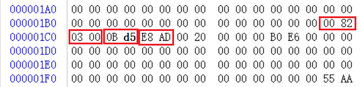

-CAD09D.svg)   

SDFake
===========================

FPGA 模拟 SD卡。

* **基本功能** ：FPGA 模拟 **SDHCv2** 版本的 **只读卡** 。
* **兼容性**  : 依据 **SDv2.0** 规范编写，已在 **绿联** 、 **川宇** 、 **飚王** 、**Realtek PCIe Card Reader** 等读卡器上识别。

|  |
| :-----------------------------------------------: |
|      图：**FPGA模拟SD卡** 与 **真实的SD卡**       |


# 背景知识

请先阅读《SD卡背景知识.docx》


# 设计代码

RTL 目录中的 **sd_fake.sv** 就是模拟 SD 卡的设计代码（可综合），它能让 FPGA 模仿 SD 卡的行为，SD-host 会将他视为一张普通的 SD 只读卡。

|  |
| :-------------------------------: |
|  图：sd_fake.sv 工作时的系统框图  |

上图是 sd_fake 工作时的系统框图，左侧 SD-host（蓝色框）是SD卡主机（往往是读卡器、嵌入式微处理器等）。SD-host 具有卡槽，通过SD标准规定的 6 线SD总线与 sd_fake 卡相连。

右侧的 sd_fake（红色框）和存储器（绿色框）共同组成一张模拟 SD 卡。其中，存储器仅仅负责提供数据。sd_fake 负责对SD总线的命令进行解析和响应，并在SD-host 请求数据时，从存储器中读取数据并传给 SD-host。

sd_fake 与存储器之间的接口是一种“给地址即出数据”的极简接口。因此存储器往往选用随机读取存储器，例如FPGA片内RAM/ROM即可。

下表描述了 sd_fake 的模块接口（省略了一部分没必要连接的状态展示信号）。

|      类型      |     信号名称     |  方向  | 位宽 | 描述                                    |
| :------------: | :--------------: | :----: | :--: | --------------------------------------- |
|    复位信号    |    rst_async     | input  |  1   | 异步复位整个控制器，包括 SD 卡状态      |
|   SD总线信号   |      sdclk       | input  |  1   | 连接到 SD-host                          |
|   SD总线信号   |      sdcmd       | inout  |  1   | 连接到 SD-host                          |
|   SD总线信号   |      sddat       | output |  4   | 连接到 SD-host                          |
| 存储器接口信号 |      rdreq       | output |  1   | 连接到存储器，rdreq=1时表明需要读存储器 |
| 存储器接口信号 |      rdaddr      | output |  40  | 连接到存储器，给出读地址                |
| 存储器接口信号 |      rddata      | input  |  16  | 连接到存储器，读入读数据                |
|    状态展示    | show_status_bits | output |  8   | 展示 SD 卡状态（可以不连接）            |

## 复位信号

复位信号 rst_async 是异步的，低电平复位的信号。当=0时，SD卡状态全部复位。在 FPGA 开始工作时应该让 rst_async=0 来让 sd_fake 复位一下，之后应该让 rst_async=1 来解除复位。

## SD总线信号

SD总线信号，包括 sdclk 、 sdcmd 和 sddat，直接引出到FPGA引脚，连接到 SD-host 即可。

> 注意：按照SD协议，sddat 信号是 inout 的，但 sd_fake 中它是 output，这是因为 sd_fake 实现的是 SD-ROM卡（只读卡），这种卡只会驱动sddat信号，而不会读它。

## 存储器接口信号

当 SD-host 请求数据时，sd_fake 模块通过存储器接口取数据。时序如下图，这些信号同步于时钟 sdclk 。rdreq 是读使能信号，在 sdclk 上升沿时，若 rdreq 出现高电平脉冲，则存储器需要将 rdaddr 地址所对应的数据读出到 rddata 信号上。然后 rddata 需要保持不变直到下一个 rdreq 高电平脉冲到来。

|  |
| :-----------------------------------------------------: |
|                  图：存储器接口波形图                   |

rdaddr 信号具有提前机制，即 rdaddr 出现有效地址比 rdreq 的上升沿提前若干周期，并会保持有效直到 rdreq 下降沿。rdaddr 的提前有以下两种情况：

- 当 rdaddr 切换至某个新的 512B 块（扇区）时，rdaddr 将比 rdreq 的上升沿早至少8个时钟周期有效。如上图中的 addr0
- 当 rdaddr 出现的地址与上一个地址属于同一个扇区时，rdaddr 将比 rdreq 的上升沿早至少1个时钟周期有效。如上图中的addr1、addr2、addr3。

之所以提供 rdaddr 提前机制，是为了给 FPGA 片外存储器（比如NorFlash）足够的时间去取数据。

## 存储器接口编址规则

存储器接口的数据线（rddata）位宽为 16bit，因此以双字节为单位编址。但根据SD卡规范，SD卡中的数据以字节为单位编址。这两者之间的转换方式是：双字节以小端序分割为两个字节，见下图。

|                            |
| :---------------------------------------------------------: |
| 图：SD 卡本身的编址规则（左）和存储器接口的编址规则（右）。 |

在双字节编址下，存储器接口的地址 (rdaddr) 位宽为 40bit，这说明存储器接口有 2*2^40=2TiB 的寻址空间，地址范围为 0x0000000000\~0xFFFFFFFFFF 。然而我们显然不会部署这么大的空间（一般的SD卡都没这么大），我们需要使用这 2TiB 中的低地址。

比如，如果我们生成的 SD 卡镜像只有前 64KiB 是有有效数据的（64KiB 后面的数据字节可能全都是 0x00 或 0xFF ，都是无效的、未使用的空间），那么我们就只需在 FPGA 里部署 64KiB 的存储器（位宽为 2Byte，深度为 32768），应该占用地址范围 0x0000000000\~0x0000007FFF

## 状态展示

状态指示信号 show_status_bits 展示 sd_fake 的状态，可以连接到 FPGA 开发板的 8bit LED 灯上，也可以不连。下表展示了每一位的含义。

| Bit位                 | 含义                                     |
| --------------------- | ---------------------------------------- |
| show_status_bits[7]   | 低：正在响应命令     高：空闲            |
| show_status_bits[6]   | 低：使用1-bit总线    高：使用4-bit宽总线 |
| show_status_bits[5]   | 低：未软复位       高：已软复位          |
| show_status_bits[4]   | 低：未在进行ACMD    高：正在进行ACMD     |
| show_status_bits[3:0] | SD 的初始化状态                          |

另外 show_sdcmd_en 、show_sdcmd_cmd 、show_sdcmd_arg 这三个信号用来展示 sdcmd 上的命令字，一般用不到，忽略即可。


# 仿真

sd_fake 可以和一个 SD 卡读卡器的代码进行联合仿真。通过该仿真，你可以看到读卡器读取SD卡时SD总线上的完整波形。仿真工程详见： [WangXuan95/FPGA-SDcard-Reader](https://github.com/WangXuan95/FPGA-SDcard-Reader) 


# 运行示例工程

本库提供了一个基于 Arty 开发板示例工程，模拟一个 FAT32 文件系统的 SD 卡。把它通过读卡器插在电脑上，可以识别出 SD 卡，并读到里面的文件，效果如下图：

|        |
| :-----------------------------------: |
| 图：Windows识别出的 FPGA 模拟的 SD 卡 |

## 模拟SD卡扩展板

为了能把FPGA的引脚连接到SD读卡器，我画了一个模拟SD卡扩展板，它一端具有SD卡的形状，另一端具有 2.54mm 排针，可以连接到 FPGA 开发板的排母上。

该板的设计详见目录 PCB 。里面的制造文件 gerber.zip 可以直接提供给 PCB 厂商来打样。

|  |
| :-----------------------: |
|    图：模拟SD卡扩展板     |

|  |
| :-------------------------------: |
|     图：模拟SD卡扩展板原理图      |

|    |
| :---------------------: |
| 图：模拟SD卡扩展板PCB图 |

PCB 制造注意事项：

* **板厚必须是 1.6mm** ，这与标准SD卡的厚度相近。
* **R1电阻(10kΩ)、C1电容(1uF)** 用于产生电源电流，有些读卡器以电源电流为SD卡插入的判据。
* **R2电阻(47kΩ)** 是必要的，因为 DAT3 信号兼具 SD卡插入上拉检测功能。
* **SDVCC电源** 由读卡器提供， **不要用来给 FPGA 开发板供电** ， FPGA 应该使用开发板自身的电源。
* 可以使用沉金工艺来让 SD 卡的金手指插拔次数更多。也可以不用沉金工艺，但插拔寿命就可能只有十几次，然后就会接触不良，这一点需要注意。

因为我们用的是 Arty 开发板，在焊接排针时，应使用 **2x6双排弯针** ，并且焊接在背面，如下图：

|  |
| :-------------------------------: |
|         图：排针焊接方向          |

然后把它插在 Arty 开发板的 JD PMOD 上，请注意方向，如下图：

|  |
| :-----------------------------------------------: |
|       图：Arty开发板与模拟SD卡扩展板的连接        |

## 下载 FPGA 并测试

用 Vivado 打开 example-vivado 目录里的工程,  编译并烧录。然后把 SD卡转接板插入读卡器，电脑中应该就能识别出 SD 卡。

|  |
| :-----------------------------------: |
|            图：插入读卡器             |

注意到工程的顶层代码 top.sv 中除了部署了一个 sd_fake 外，还用一个很大的 always 块实现了一个 ROM （实现了存储SD卡数据的存储器）：

```verilog
always @ (posedge sdclk)
    if(rom_req)
        case(rom_addr)
        40'h00000000df: rom_data <= 16'h8200;
        40'h00000000e0: rom_data <= 16'h0003;
        40'h00000000e1: rom_data <= 16'hd50b;
        40'h00000000e2: rom_data <= 16'hade8;
        // 省略 390 行... //
        default:        rom_data <= 16'h0000;  // .hex 镜像里大多数数据都是 0
        endcase
```

ROM 中的数据就来自于一张真实的SD卡的全盘导出，导出方法详见《SD卡背景知识.docx》。

我导出的 .hex 镜像文件用 Winhex 打开后，可以看到如下图的数据，以上 ROM 代码就是根据这些数据编写的。

比如，下图中的 00 82 对应的地址是 0x000001BE ，存储器接口的编址规则，得到存储器接口中的地址是 0x1BE/2 = 0x0DF ，因此得到一行 Verilog 代码： `40'h00000000df: rom_data <= 16'h8200;` （注意因为是小端序，所以是 16'h8200 而不是 16'h0082 ）

|                    |
| :-------------------------------------------------: |
| 图：用 Winhex 查看 SD卡全盘导出得到的 .hex 镜像文件 |

