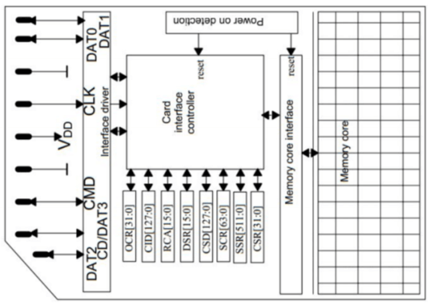
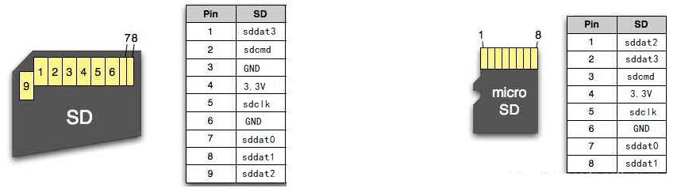
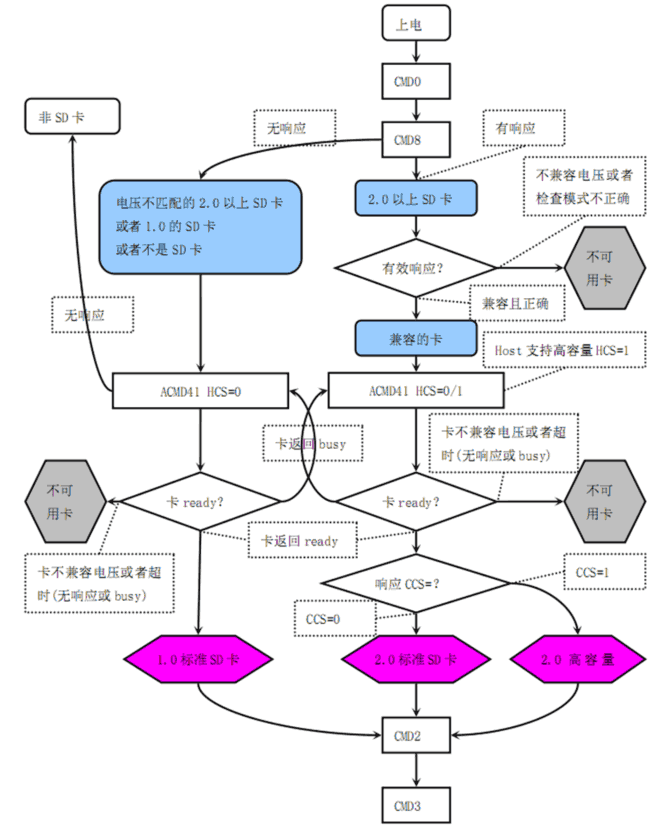
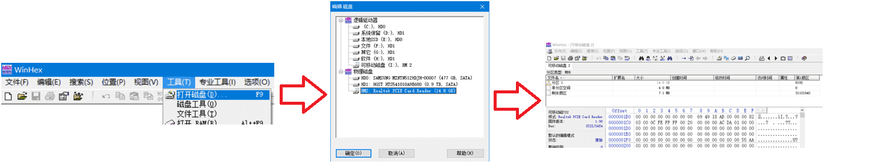
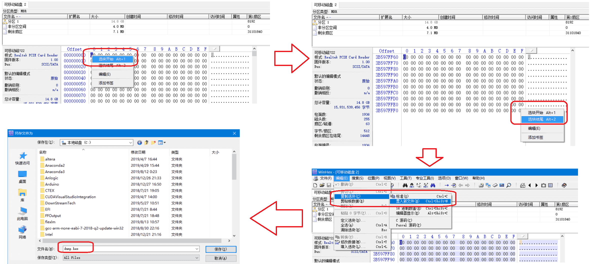

[English](#en) | [中文](#cn)

　

SDCard Background
===========================

Intuitively, an SD card is just a storage device, it can work as long as it specifies read and write operations. But in fact, as a typical consumer electronic product, the complexity of the SD card interface (SD bus, SDIO) is no less than that of the UDP+IP protocol stack. The reason is  not only a historical problem, but also the consideration of compatibility with various SDcard readers.

This document briefly introduces the background knowledge of SDcard and SD protocol, so that you can understand what the sd_fake.sv I wrote has done.

## SDcard structure

|  |
| :-------------------------------------------------: |
|         Figure1: SDcard internal structure.         |

As shown in Figure1, An SDcard includes:

- Card interface controller: Handles SD bus protocol, parses commands from SD-host and response it.

- Memory core (Flash array): Providing data. The Flash array has byte-addressed addresses, each 512 bytes is a sector, the address range of sector 0 is 0x00000000\~0x000001FF, the address range of sector 1 is 0x00000200\~0x000003FF, and so on… All read and write operations are performed in sectors as the smallest unit. The reason why random read and write in bytes is not supported is because the Flash array is essentially NAND-Flash, and NAND-Flash does not support random read and write.

## SD bus

SDcards are connected to the SD-host (such as the SDcard adaptor) using SD bus. The signals of SD bus include:

| Signal name                      | Direction                                                    |
| -------------------------------- | ------------------------------------------------------------ |
| `sdclk`                          | host→ card.                                                  |
| `sdcmd`                          | host→ card when request command, card→host when respond command. |
| `sddat0, sddat1, sddat2, sddat3` | host→ card when write data, card→host when read data.        |

These signals is defined in Figure2. Note that there is no difference in function between SDcard and microSDcard except for size and appearance.

|                                     |
| :----------------------------------------------------------: |
| Figure2: pin definition of SDcard (left) and microSDcard (right). |

## SD protocol

The SD protocol runs on the SD bus. The SD protocol specifies nearly a hundred commands, which are divided into two categories: CMD and ACMD. For example, CMD0 can reset the SDcard, CMD2 can obtain the CID register of the SDcard, CMD6 can switch SDcard mode, ACMD6 to switch 1bit mode and 4bit mode of `sddat`, CMD17 reads a single-sector, CMD18 reads multi-sectors... To handle these commands, you need to read SD2.0 protocol specification carefully. For example, when the SDcard powers on, the SD-host will perform a complex command sequence as shown in Figure3.

The interface controller in SDcard is to respond these commands to let the SD-host identify SDcard correctly. The **sd_fake.sv** that I wrote is mainly to imitate the function of the interface controller.

|  |
| :-------------------------------------------------: |
|     Figure3: SDcard power up command sequence.      |

## File system

In order to organize disk partitions and files in the linear storage space of SDcard, people stipulate complex data structures called file systems. For example, the most commonly used file systems for SDcards are FAT16 and FAT32.

Therefore, with sd_fake.sv, the SDcard can be identify correctly. But there's another precondition to let it to be identify as a disk partition: the flash array must contain a legal file system. Practically, if the contents in the Flash array is blank (all 0x00) or random, then the SD card is an unformatted SD card, similar to a hard disk that has just been shipped from the factory or damaged. It is a legal physical disk, but has no logical partitions in it. The file system is a complex data structure. It stores the partition, directory structure, file allocation table and other information in the Flash array, so that the SD card can be recognized as the C:, D:, E: disk partitions in Windows.

The most commonly used file systems for SDcards are FAT16, FAT32 and exFAT. They divide the Flash array into multiple areas, some are used to store partition information, file allocation table, etc., and the others are data areas which store files. There's no need to understand this data structure in detail, if you are interested, you can read https://fi.wikipedia.org/wiki/FAT .

## SDcard full-disk dump

sd_fake.sv imitates a read-only SDcard, so if you want to imitate a SDcard containing several files, you need to copy these files into a real SDcard, and then dump out this SDcard's entire content (that is, the entire file system), and put it into a ROM in FPGA. When SD-host initiates a read sector command through SD bus, sd_fake.sv will read sector data from the ROM and send it to SD-host.

Now I introduce how to use WinHex software to dump the entire SDcard, you will get a .hex file, which contains the entire content of an SDcard (usually we call it an image file).

1. Download and install WinHex software (steps are omitted).
2. Plug an SDcard into the computer through an SDcard adaptor.
3. Run WinHex software as an administrator, select **Tools→Open Disk** on the upper toolbar, select **Physical Disk→SD Card** , you will see the full disk content after opening, as shown below.
4. Right-click the first byte, click **Select Block Start**. Then use the scroll bar to drop down to the bottom, right-click the last byte, and click **Select Block End**. After selecting, click **Edit->Copy Selection->Save to New File** in the upper toolbar, name the file xxx.hex and save it. As shown below.
5. The dumped .hex file can also be opened and viewed using Winhex.

　

　

　

SD卡背景知识
===========================

从直觉上，SD卡只是一种 Storage 设备，其接口只要规定读写操作就能工作。但实际上作为典型的消费电子产品，SD卡的接口（SD 总线，SDIO）的复杂度不亚于 UDP+IP 协议栈。究其原因，既有历史遗留问题，又有兼容各种读卡器的考虑。

本文档大致介绍 SD卡和 SD 协议背景知识，让大家理解我编写的 sd_fake.sv 都完成了哪些工作。

## SD卡结构

|  |
| :-------------------------------------------------: |
|               **图1**：SD 卡内部结构                |

如**图1**，一张SD卡包含：

- **接口控制器** (Card interface controller) ：负责处理 SD 总线协议，解析 SD-host 发来的命令并提供响应。

- **Flash阵列** (Memory core) ：负责提供数据。Flash 阵列拥有以字节编址的地址，每 512 字节为一个扇区（Sector），扇区0的地址范围为 0x00000000\~0x000001FF，扇区1的地址范围为 0x00000200\~0x000003FF，以此类推……。所有的读写操作都以扇区为最小单位。之所以不支持以字节为单位的随机读写，是因为Flash阵列本质上是NAND-Flash，NAND-Flash不支持随机读写。

## SD总线

SD卡使用 SD 总线与 SD-host （比如读卡器）连接，SD总线的信号包括：

| 信号名                         | 输入输出方向                                     |
| ------------------------------ | ------------------------------------------------ |
| sdclk                          | host→ card                                       |
| sdcmd                          | 当发起命令时 host→ card ，当响应命令时 card→host |
| sddat0、sddat1、sddat2、sddat3 | 当写数据时 host→card ，当读数据时 card→host      |

这些信号在 SD 卡和 microSD 卡上的引脚定义如**图2**（SD卡和microSD卡除了外形尺寸外，功能上没有差别）

|                          |
| :-----------------------------------------------: |
| **图2**：SD 卡（左）与 microSD 卡（右）的引脚定义 |

## SD协议

SD 总线上会运行 SD 协议，SD 协议规定了近百条命令，分为CMD命令和ACMD命令两大类，例如 CMD0 命令可以将SD卡复位、CMD2 命令获取 SDcard 的 CID 寄存器、CMD6 命令切换 SD 卡模式、ACMD6 命令切换 `sddat` 的 1bit 模式和 4bit 模式、CMD17 命令是单扇区读、CMD18 是多扇区读……需要仔细阅读SD2.0协议手册才能了解。例如，SD卡上电时，SD-host会进行如**图3**的复杂的命令序列。

SD卡内的接口控制器就是要正确的响应这些命令，让 SD-host 能够正确识别 SD-card。我编写的 sd_fake.sv 主要就是模拟接口控制器的功能。

|  |
| :-------------------------------------------------: |
| **图3**：SD 卡上电后，SD-host 向 SD卡发送的命令序列 |

## 文件系统

为了在 SD卡这片线性的存储空间中组织磁盘分区和文件，人们规定了复杂的数据结构——文件系统，比如 SD卡最常用的文件系统是 FAT16 和 FAT32 。

因此，有了 sd_fake.sv ，SD卡就可以正确的被识别了。但要想让它被识别为磁盘分区，Flash 阵列的内容还必须是一个合法的文件系统。具体而言，Flash阵列中的信息如果是空白的，或是胡乱随机的，那么该SD卡就是未格式化的SD卡，类似于刚出厂的硬盘或者受损的硬盘。它是一个合法的物理磁盘，但其中没有逻辑分区。而文件系统就是一个复杂的数据结构，它在Flash阵列中存放了分区、目录结构、文件分配表等信息，这才能让SD卡被识别为 Windows 中的 C: 、 D: 、 E: 这些磁盘分区。

SD卡最常用的文件系统是 FAT16 、 FAT32 和 exFAT。它们都把 Flash 阵列划分为了多个区域，一部分用来存储分区信息、文件分配表等，另一部分（数据区）才是存放文件的地方。该数据结构不需要你详细了解，如果有兴趣可以阅读 https://fi.wikipedia.org/wiki/FAT 。

## SD卡全盘导出

sd_fake.sv 模拟的是一个只读的 SD卡，因此如果要模拟一张包含了几个文件的 SD 卡，需要把这些文件拷入一张真实的SD卡，然后把这张SD卡的Flash阵列中的所有内容（也就是整个文件系统）都导出，这称为全盘导出，并放入 FPGA 中的 ROM 里。当 SD-host 通过SD总线发起读扇区的命令时，sd_fake.sv 会从该 ROM 中读取扇区数据并发送给 SD-host。

下面讲解如何使用 WinHex 软件对SD卡进行全盘导出，你将获得一个 .hex 文件，该文件包含一张SD卡的全盘内容（一般称为镜像文件）。

1. 下载安装WinHex软件，步骤**略**。
2. 将SD卡通过读卡器插入电脑。
3. 以**管理员身份**打开WinHex软件，在上方工具栏选择 **工具→打开磁盘**，选择 **物理磁盘→SD卡** ，打开后可以看到全盘内容。如下图。
4. 右键点击第一个字节，点击**选块开始**；用滚动条下拉到最下面，右键最后一个字节，点击**选块结尾**。选中后，在上方工具栏点击 **编辑->复制选块->置入新文件**，将文件命名为 xxx.hex ，并保存。如下图。
5. 导出的 .hex 也可以用 Winhex 打开并查看。

