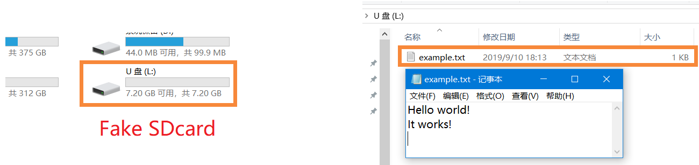
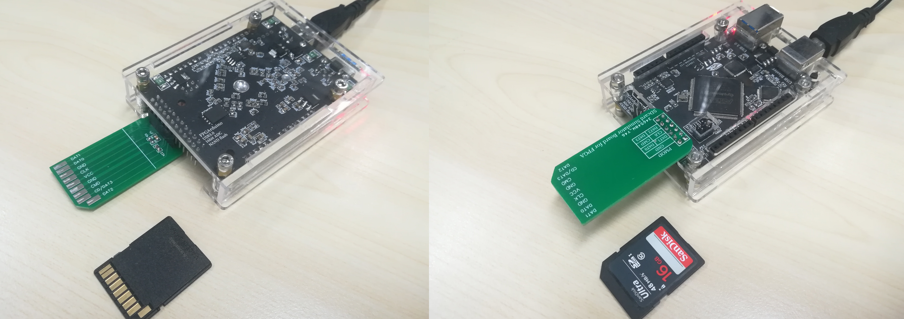
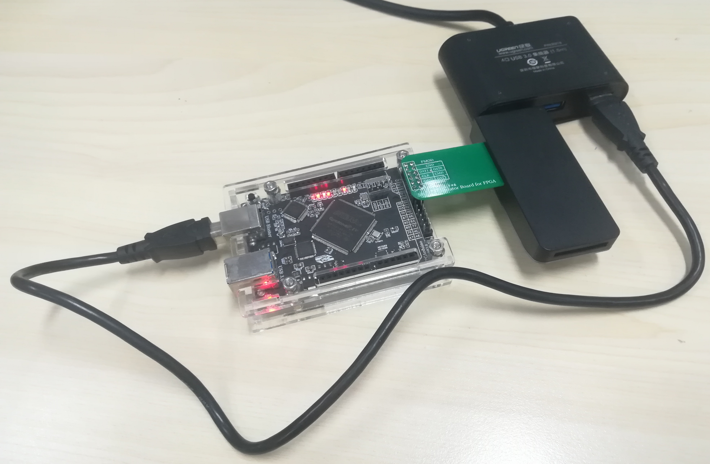

FPGA 模拟 SD卡 示例 (基于Altera FPGA)
===========================

该示例用FPGA模拟一个格式化好的SD卡(FAT32)。效果如下图：

|  |
| :------: |
| 图：Windows识别出的FPGA模拟SD卡 |

# 硬件连接

将 [SDcard Simulator 转接板](../hardware/) 插在你的Altera FPGA开发板上，注意找一个合适的位置，谨防短路。

|  |
| :------: |
| 图：笔者的 Altera FPGA 与 转接板的连接 |

# 建立工程

该工程使用笔者自己的Altera FPGA开发板，因此仅供参考。为了移植到你自己的FPGA板上，在编译工程前，需要 **重新选择器件** ， **重新分配引脚** 等步骤。具体步骤略。

# 测试

如下图，SD卡转接板插入读卡器后，在Windows中识别出SD卡设备。

|  |
| :------: |
| 图：测试 |
