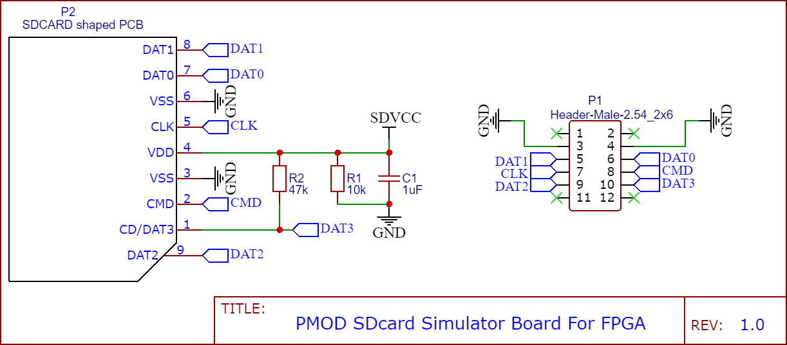

FPGA SDcard Simulator 电路
===========================

为了将读卡器连接到FPGA，我画了SD形状的PCB，兼容PMOD接口，这里提供的制造文件 **gerber.zip** 可以直接用来生产PCB。

|  |
| :--------: |
| 图：SD形状的PCB |

## 注意事项

* **板厚必须是 1.6mm** ，这与标准SD卡的厚度相近。
* **R1电阻(10kΩ)、C1电容(1uF)** 是必要的，用于产生电源电流，有些读卡器以电源电流为SD卡插入的判据。
* **R2电阻(22kΩ)** 是必要的，因为 DAT3 信号兼具 SD卡插入上拉检测功能。
* **SDVCC电源** 由读卡器提供， **不要用来给 FPGA 系统供电** ， FPGA 应该使用开发板自身的电源。
* **排针顺序** ：2x6pin，2.54mm 间距，兼容 PMOD，PMOD是 Xilinx FPGA 开发板常用的一种接口。
* **排针焊接** : 排针焊接时，请根据具体情况使用 **公头还是母头** 、 **直排针还是弯排针** 、以及焊接在 **正面还是反面** 。如果你使用 Arty开发板，见 [example-Vivado](../example-Vivado)

|  |
| :--------: |
| 图：原理图 |

| :--------: |
| 图：PCB图 |
